# Pensum Perfecto RPA

## Requisitos

- Tener una cuenta de Office con acceso básico o mayor a Power Automate y Excel
- Tener una instalacion de Power Automate Desktop y Excel
- Para el uso compartido se debe tener una carpeta en el explorador de archivos vinculada con una nube como OneDrive

## Instalación

Para el proceso de instalación en necesario copiar y pegar los archivos fuente del programa en un flujo personal

1. Abrir Power Automate Desktop y crear un nuevo flujo

   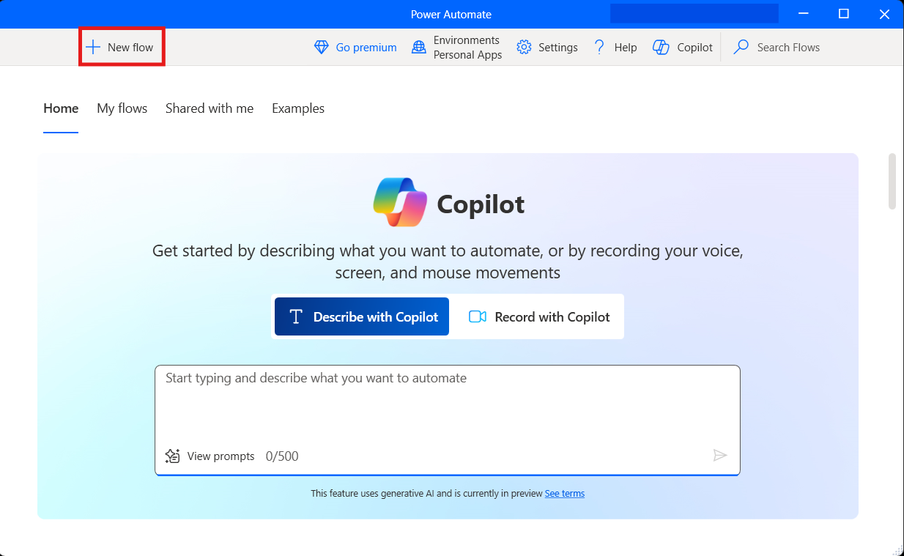

1. En la ventana de creación del flujo escribe un nombre para el programa y activa la opción de Power Fx

   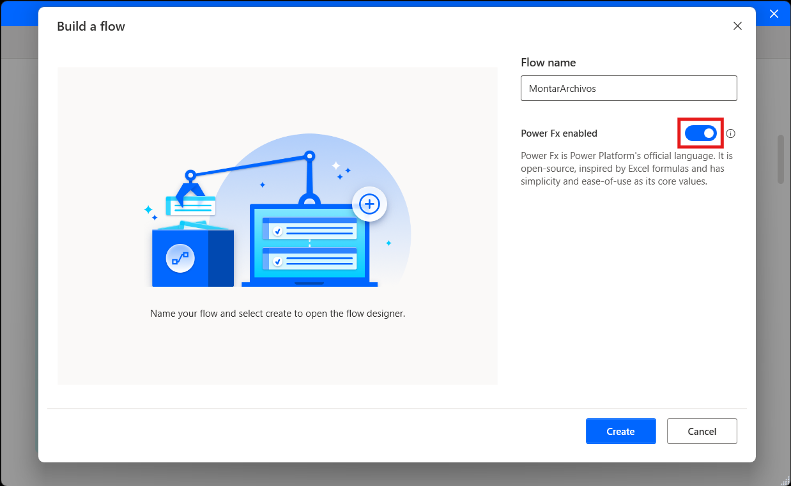

1. Copie uno de los archivos fuente del repositorio

   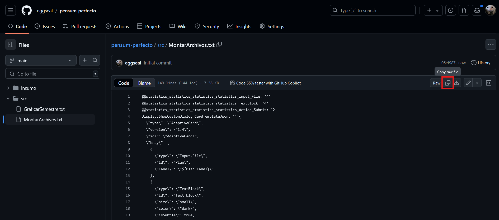

1. Vuelva a abrir la ventana del flujo que creó y haga clic en la sección central

   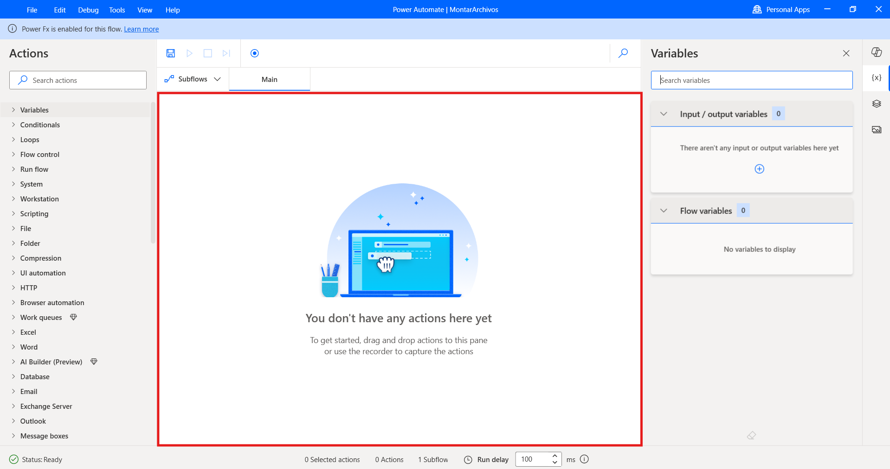

1. Presione `Ctrl + V` para pegar el flujo

   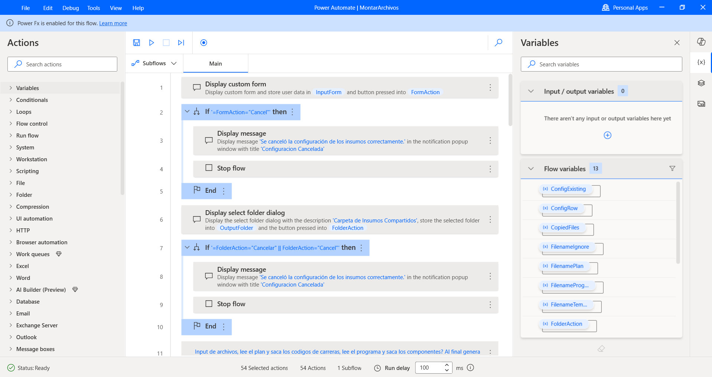

1. Repita el proceso de crear otro flujo nuevo para el otro archivo fuente

   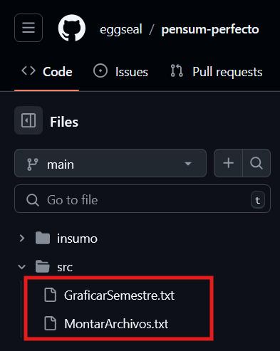

## Estructura

```
Pensum-Perfecto
│   PlantillaEjemplo.xlsx
│   README.md
├───img
│       image.png
│       image2.png
│       image3.png
│       image4.png
│       image5.png
│       image6.png
├───insumo
│   │   config.txt
│   └───Antiguo
│           __relleno__
└───src
        GraficarSemestre.txt
        MontarArchivos.txt
```

- El directorio `img` simplemente guarda las imagenes usadas en esta guía
- El directorio `src` guarda todos los archivos fuente

  - `MontarArchivos.txt` Es el flujo que gestiona el directorio de insumos, genera y actualiza los archivos de insumo para que el flujo de graficar pueda utilizarlos de forma rapida
  - `GraficarSemestre.txt` Es el flujo encargado de leer los insumos y generar la grafica del horario

- El directorio `insumo` guarda los archivos gestionados por el programa, esta es la carpeta que se le debe pasar a los flujos para que estos manejen los insumos. **Es importante que esta carpeta no se modifique manualmente ya que puede provocar errores en los flujos.**

  - El subdirectorio `insumo/Antiguo` almacena una copia de todos los insumos reemplazados por `MontarArchivos.txt`. Esta carpeta puede ser modificada libremente.

    - El archivo `__relleno__` existe unicamente para poder subir el subdirectorio `insumo/Antiguo` a GitHub.

- El archivo `PlantillaEjemplo.xlsx` es un ejemplo de la plantilla que usa el flujo de graficación, es importante que la posicion de las celdas no se modifique.

## Uso

### MontarArchivos

1. Ejecute el flujo

   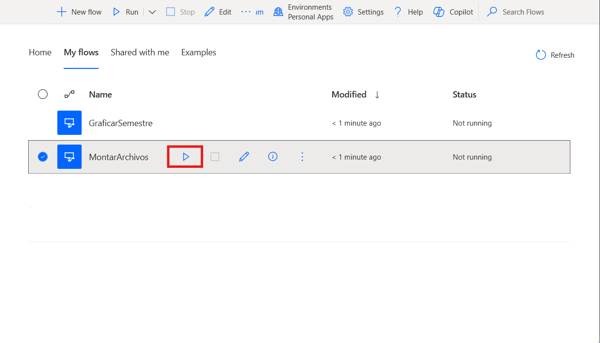

1. Busque todos los archivos de insumo que vaya a montar. Todos los campos son opcionales, solo es necesario montar los archivos que se van a modificar.

   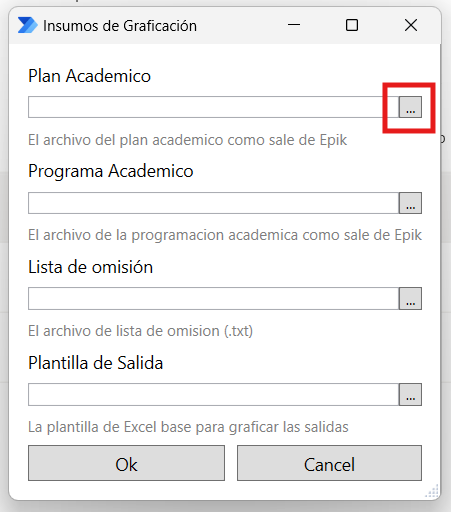

   - **Plan Academico:** El archivo que contiene el listado de todas las materias por semestre de cada carrera

     Requiere las siguientes columnas:

     - Nro Semestre: **D**
     - Catálogo: **F**

   - **Programa Academico:** El archivo que contiene todas las clases por materia de cada carrera

     Requiere las siguientes columnas:

     - Codigo Catalogo: **D**
     - Numero de Clase: **J**
     - Hora Inicio: **T**
     - Hora Fin: **U**
     - Dias: **V**
     - Componente: **AI**

   - **Lista de omision:** Un archivo `.txt` que contiene una lista de codigos de materia para omitir de la graficacion

     - Cada codigo va separado en su propia linea
     - Para omitir todas las clases de un mismo tipo se escribe el comienzo del codigo

       ```
       NM1001
       BU
       ```

       Por ejemplo, un archivo como el de arriba omite la clase NM1001 y todas las que comienzen con BU

   - **Plantilla de Salida:** Un archivo de Excel que es usado como la base de la grafica, el archivo `PlantillaEjemplo.xlsx` muestra un ejemplo de como se ve esta plantilla.

     Celdas importantes:

     - **B1:** El programa escribe el codigo de la clase graficada
     - **B2:** El programa escribe el semestre graficado
     - **B3:** El programa escribe el numero maximo de clases necesitadas para graficar
     - **B5:** En el ejemplo se usa para hacer una busqueda en la que se resalten todas las casillas que contengan el valor en la celda. Esto es una formula del excel independiente del programa y no es necesaria.
     - **F3 - L35:** El programa usa este area para escribir las clases respectivas de cada horario.

1. Seleccione la carpeta donde se van a gestionar los insumos, si se sigue la estructura del repositorio seria la carpeta `./insumo`, para usar insumos compartidos se necesita una carpeta que este vinculada a una nube como OneDrive o SharePoint

   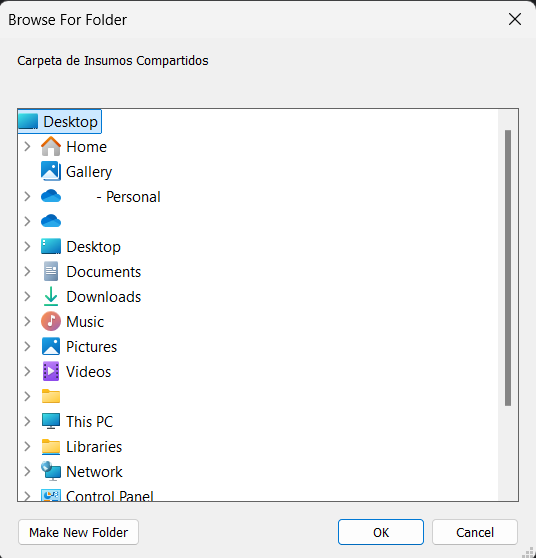

Los archivos quedaran guardados en la carpeta seleccionada, es importante que los archivos generados alli no sean modificados manualmente, si es necesario reemplazar un archivo debe hacerse por este mismo flujo.

Dentro de la carpeta seleccionada debe haber una carpeta `Antiguo` creada manualmente para evitar posibles errores de permisos, en esta carpeta se guardaran todos los insumos reemplazados por el flujo

### GraficarSemestre

1. Ejecute el flujo

   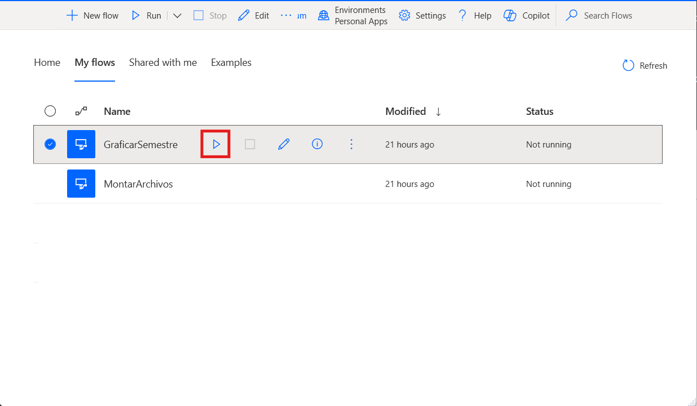

1. En la ventana "Reiniciar Flujo" selecciona el modo de lectura del programa.

   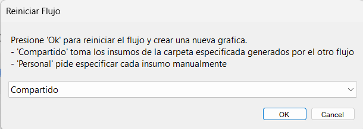

   - **Compartido:** Pide por la ruta de la carpeta de insumos generada por el flujo `MontarArchivos.txt`, si se sigue la estructura del repositoria seria la carpeta `./insumo/`. No necesariamente tiene que ser una carpeta compartida.

     

   - **Personal:** Pide la entrada de los insumos manualmente, en este caso el Plan Academico y el Programa Academico son obligatorios. Los archivos siguen el mismo formato que el flujo [MontarArchivos](#montararchivos) paso 2

     

1. El programa abre los archivos Plan Academico y Programacion Academica en Excel y pide seleccionar el codigo de un programa como aparecen en los nombres de las hojas del Plan Academico.

   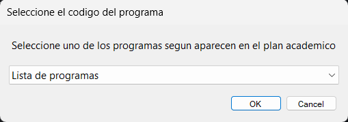

   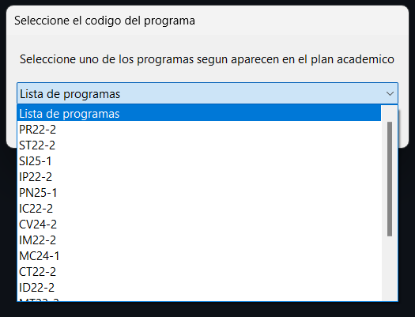

1. Luego pide los parametros de graficacion

   - **Limite de clases:** La cantidad maxima de clases que se acepta por materia, si una materia tiene mas horarios que el limite se omite de la grafica.

     El limite se compara por componente, si el limite es `7` y una materia tiene 6 clases y 4 laboratorios no la omite.

     Para graficar sin limite ponga el valor en cero (0)

   - **Semestre:** El valor del semestre como aparece en el Plan Academico

   - **Componentes:** Una seleccion de todos los componentes que se grafican de cada materia.

   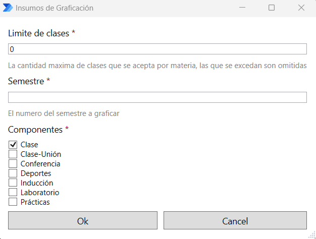

1. Por ultimo confirme la lista de clases omitidas de la grafica, esta lista tiene preseleccionadas las clases encontradas por la lista de omision del insumo seleccionado pero aqui puede seleccionar clases adicionales o eliminar la seleccion de alguna clase sin modificar el insumo.

   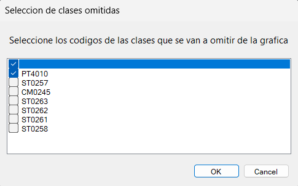

1. El programa vuelve a preguntar para reiniciar el flujo, presione 'Cancelar' para salir del ciclo o repita desde el paso 1, si se realiza otra grafica esta queda en una instancia nueva de Excel, por lo que guardar el archivo resultado o cerrarlo no afecta al proximo ciclo

   

Al final queda la grafica en la plantilla seleccionada donde las celdas que contengan una clase son marcadas de color rojo

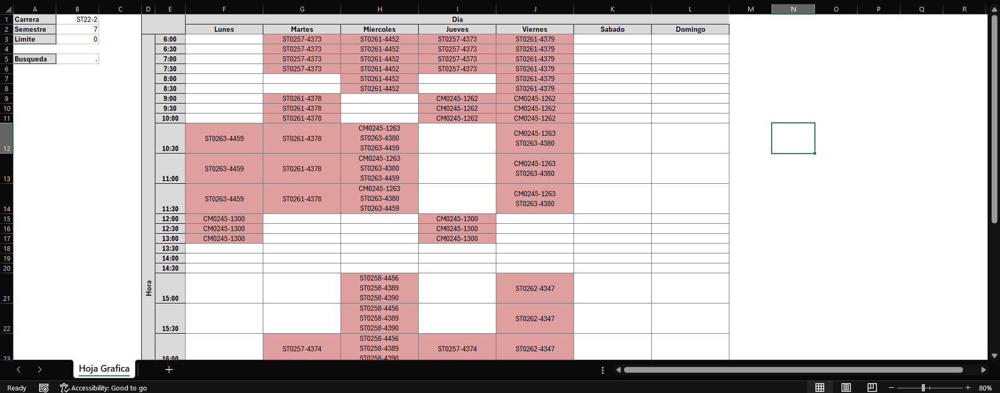

En la celda B5 se puede escribir un codigo de clase con las mismas reglas que la lista de omision para resaltar una o varias clases en especifico, para no resaltar nada se deja la celda con un punto `.`

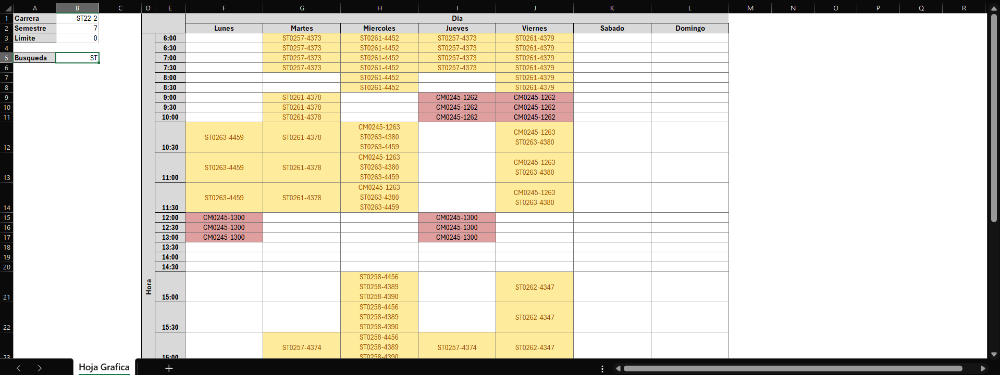

En este caso resaltando todas las materias de tipo `ST`
